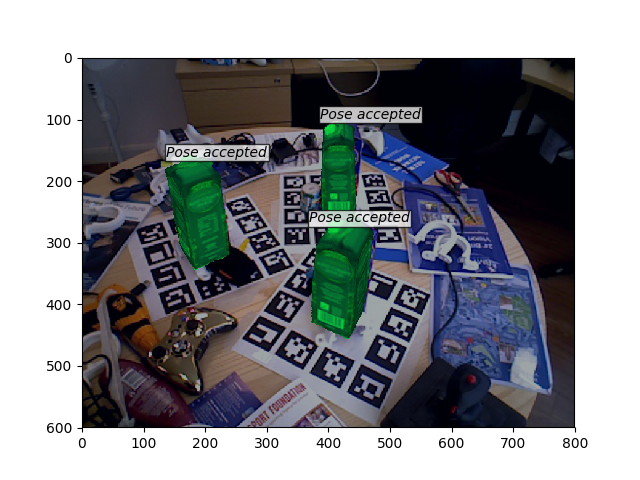

# A 6D Object Pose Estimation Network based on Faster R-CNN

## 1. Introduction

Faster R-CNN adaptation for 6D Object Pose Estimation, based on https://github.com/chenyuntc/simple-faster-rcnn-pytorch/

Visualization and evaluation scripts use code from https://github.com/thodan/sixd_toolkit

## 2. Dependencies

    1. Python3
    2. [Pytorch 0.3](https://pytorch.org/) with CUDA or newer;
    3. [Cupy](https://docs-cupy.chainer.org/en/latest/install.html#install-cupy-with-cudnn-and-nccl)
    4. Dependencies for Simple Faster R-CNN and SIXD Toolkit: `pip install -r requirements.txt`
    5. Glumpy - the backend for rendering: `apt-get install libglfw3`

(Optional) Download link for the trained [RGBD checkpoint](https://drive.google.com/open?id=1gvOmm9vb95zjigMnwKFyX2xUJfbN0vOZ) (compatible with the rgbd branch, achieves 0.453 ADD)

## 3. Usage

1. First, download the checkpoint of the pre-trained VGG16 weights: 

`mkdir checkpoints/`
`python misc/convert_caffe_pretrain.py`

2. For visualization, start the Visdom server: 

`nohup python3 -m visdom.server &`

To view the visualizations, go to `http://localhost:8097/`

3. If the provided checkpoint has been downloaded, please move it into the new `checkpoints` directory, and start training by:

`python3 pose_train.py train --env='fasterrcnn-caffe' --plot-every=100 --caffe-pretrain --load-path="checkpoints/rgbd_network_0.4531493603989289"`

Otherwise, leave out the `--load-path` option

4. All configuration can be set in `utils/config.py`